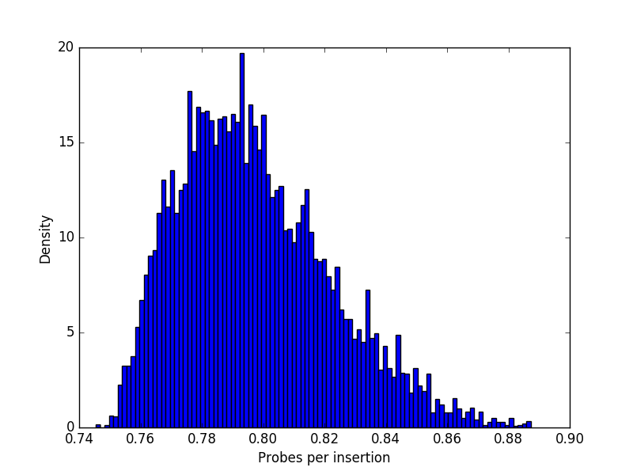

# Single hashing

Single hashing is a generalized hashing technique described by [Knuth](http://www.cs.virginia.edu/diochnos/about/KnuthCSMaths.pdf). A hash function, `f(x)`, selects a row from an `m` by `m` matrix `Q`. The elements in the row indicate the sequence of locations to probe in order to store `x` in the hash table.

The rows of matrix `Q` each contain numbers `0` through `m - 1` in any order, except for the first column which contains `0...m - 1`. For example, the following is a randomly-generated `Q`:

<div align="center">
  
</div>

The hash table first attempts to place element `x` in location `f(x)`, or `Q[f(x), 0]`. If location `f(x)` is not empty, then it attempts to place `x` in the next location in the row. This continues until all of the memory locations are exhausted. 

As the hash table is filled with values, some congestion is bound to occur. The efficiency of the probing sequence will determine the amount of congestion. One measure of efficiency is the number of slots that must be examined at before an empty slot is discovered. This depends on the probing strategy and how full the table is when an insertion is made.

For example, a cyclic probing scheme can be defined with the following matrix:

<div align="center">
  
</div>

Given a hash table of size `m` with `n` slots already filled, let `d(m,n)` be the expected number of probes to complete the next insertion. In an empty table, the first insertion will always return an empty location, so `d(m, 0) = 0`. In a table containing only 1 slot filled, `d(m, 0) = 1 / m`, since only 1 out of m positions is taken. The general formula for `d(m,n)` is

     d(m, n)=\sum_{ k >= 0} k * p_k(m, n)

where `p_k(m, n)` is the probability that the `n`th insertion makes exactly `k` probes.

An alternative efficiency measure is given by the expected number of probes after `n` insertions are made, `δ(m, n)`. When `n = m`, this corresponds to the number of probes completed by the time the hash table is completely full.

The efficiency of 10k randomly-generated `Q` for `m = 5` can be analyzed.

```python
import random
random.seed(1234)

score_Q = [(delta_prime(Q), Q) for Q in [random_Q(m) for _ in range(10000)]]

min_score, min_Q = min(score_Q, key=itemgetter(0))
max_score, max_Q = max(score_Q, key=itemgetter(0))
```

```
Best score: 0.746 
[[0, 1, 2, 4, 3], 
 [1, 3, 4, 2, 0], 
 [2, 4, 1, 3, 0], 
 [3, 2, 0, 4, 1], 
 [4, 0, 3, 1, 2]]

Worst score: 0.887 
[[0, 4, 2, 1, 3], 
 [1, 4, 2, 3, 0], 
 [2, 4, 1, 3, 0], 
 [3, 1, 4, 2, 0], 
 [4, 1, 2, 3, 0]]
```

The distribution of scores is given by:

```python
import matplotlib.pyplot as plt

plt.hist(list(zip(*score_Q))[0], bins=100, normed=True)
plt.xlabel('Number probes')
plt.ylabel('Density')
```

<div align="center">
  
</div>